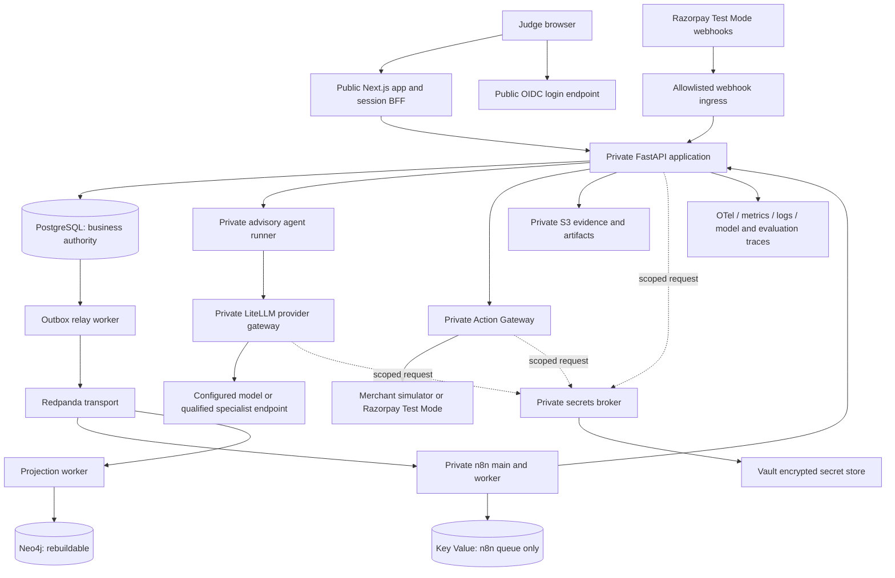

# RECLAIM hosted final-round design

Date: 2026-09-05. Status: planned; no hosted qualification is claimed.

This design translates the user-supplied final Razorpay-round conversation and
the request for a private backend secrets API into a completion target. It extends
FS-001/FS-002 without replacing their business-state, financial, or agent boundaries.

## Outcome and scope

One judge-facing URL supports login, incident submission, fresh model analysis,
evidence/timeline review, deterministic exposure and policy, a separate human
approval, execution through the Action Gateway, reconciliation, verification or
escalation, and a reproducible audit view. The hosted claim is a production-oriented
system validated with synthetic incidents, simulators, and optionally an actually
qualified Razorpay Test Mode connector. Real merchant production is a separate tier.

| ID | Required outcome | Completion evidence |
|---|---|---|
| F01 | Fresh-volume n8n intake, duplicate delivery, failure and restart recovery | T153 live backend and browser evidence; skipped tests do not pass this gate |
| F02 | n8n owns all new orchestration; Temporal drain is resolved | T154 inventory, parity and recovery evidence before an explicit cleanup decision |
| F03 | Production composition mounts the full authenticated product | Container test exercises real routes and database-backed readiness with demo flags off |
| F04 | Full incident-to-terminal lifecycle survives approval waits/restarts | One authoritative run/action identity through `verified_contained`, `verified_failed`, or `escalated_unresolved` |
| F05 | Fresh agent remains advisory with no side-effect credentials | Typed-output, prompt-injection, capability and provider-outage tests |
| F06 | Specialist round 2 has actual data, training and comparison evidence | Sealed corpus, observed inference reports and reproducible promotion decision |
| F07 | Secrets arrive from a separate private backend container | Mutual-TLS API, explicit access matrix, rotation/outage tests and external reachability test |
| F08 | Real secret values stay out of source, images, browser and traces | Repository/build/client-artifact checks plus runtime canary leakage tests |
| F09 | OIDC login and tenant/role enforcement replace demo tokens | Login/logout/expiry, wrong-tenant and separation-of-duties browser/API tests |
| F10 | Persistent services and migrations work on hosted infrastructure | Fresh and upgrade migrations, restart, backup/restore and integrity checks |
| F11 | Render deployment is reproducible | Validated Blueprint, immutable release identities and a service/secret inventory |
| F12 | Operations and evaluations can be demonstrated | Correlated traces, metrics, logs, model traces, evaluation manifests and audit links |
| F13 | Final demo is repeatable and honestly labeled | Hosted desktop/mobile walkthrough, failure scenario, release evidence and judge script |

## Observed starting point

The reviewed code is the baseline previously published to `Googieman/Reclaim`.
Historical results in `PROJECT_STATUS.md` are evidence from previous runs, not
tests rerun while writing this plan.

- T153 and T154 remain unchecked in FS-001. T153's last recorded issue was Kafka
  Trigger envelope parsing after several bootstrap compatibility fixes.
- `backend/api/main.py` builds most usable functionality via `LocalDemoRuntime`.
  Its module-level production construction does not supply the services needed
  to mount the full product; its non-local readiness path runs replay.
- Fresh-agent configuration currently rejects `environment=production`.
- The frontend image bakes demo tokens and its API rewrite destination into the
  build. Runtime environment variables alone do not repair that build output.
- The backend Dockerfile has a second, incomplete dependency list rather than
  installing the declared application package. Fixed ports are not by themselves
  a Render blocker; all start commands, health checks and consumers must agree.
- The Razorpay action adapter is a validation/simulator seam without a provider
  HTTP client. An API key alone will not make Test Mode actions real.
- The specialist has an observed one-row training run, zero validation/held-out
  cases, unrun comparison reports and a `DON'T SHIP` decision.
- Vault path/policy boundaries exist; the requested private secrets broker does
  not. No `render.yaml` is present.

## Hosted topology

The diagram's arrows describe allowed application relationships, not an assertion
that Render provides a firewall for each arrow. The network and identity controls
must be tested on the selected deployment.

| Component | Planned placement | Exposure and purpose |
|---|---|---|
| Next.js web/BFF | Render `web` | Public HTTPS; server-side sessions; narrow API forwarding |
| OIDC login | Managed OIDC or Keycloak behind a login-only ingress | Public authorization/token/JWKS routes; admin interface restricted |
| Webhook ingress | Exact route on the web/BFF | Public only for signed, original-byte Test Mode webhooks |
| API | Render `pserv` | Authenticated internal product and n8n endpoints |
| Agent runner | Render `pserv` | Redacted evidence and typed proposals; no broker grants or provider keys |
| LiteLLM provider gateway | Render `pserv` | Trusted provider transport and budgets; holds only model credentials |
| Action Gateway | Render `pserv` | Approved action IDs, scoped connector credentials, deterministic execution |
| Secrets broker | Render `pserv` | No public hostname; mutual TLS for secret reads |
| n8n main/worker | `pserv` and `worker` | Own database role/schema; queue; bounded API/event credentials |
| Outbox relay | Render `worker` | Scoped PostgreSQL outbox access and Kafka producer credential |
| PostgreSQL / Key Value | Render managed data services | Separate service roles; internal connections; queue recovery validated |
| Redpanda | Managed cluster meeting ADR-005, or a qualified private deployment | SASL_SSL, topic/group ACLs and client certificates under the current decision |
| Evidence/artifacts | Managed S3-compatible object store | Private buckets, checksum and immutable-write semantics tested |
| Vault | Managed private-access endpoint or Render private Vault with disk | TLS, scoped auth, encrypted storage, initialization/unseal and restore runbook |
| Neo4j + projection worker | Managed Neo4j or private service; Render worker | Persisted projection checkpoints; graph loss cannot corrupt business state |
| Observability | Private OTel collector and managed Prometheus/Grafana/Loki | Redacted logs/metrics/traces; dashboards require operator access |
| Langfuse | Managed project by default | Redacted model traces linked by run ID; not required for action correctness |
| MLflow | Private service with separate DB role and private artifact prefix | Model/evaluation lineage; publishing credentials belong to evaluator only |

Keep Neo4j, Langfuse and MLflow in the planned final-round scope. They may proceed
in parallel with core lifecycle work. Do not call them integrated merely because
their images start. Training runs separately from the always-on application;
choose serving compute from observed memory/latency needs after model selection.

## Decisions and dependencies

- Plan for a paid multi-service staging environment. Workspace, region, service
  sizes, provider subscriptions, domain and spending cap remain deployment inputs;
  no billable resource is provisioned by this planning work.
- Use Git-backed Docker builds initially; record deployed commit and image identity.
  Update the existing release preflight to recognize Render evidence, rather than
  pretending Compose image variables qualify a different deployment.
- Use one region/workspace for the Render application services. Managed external
  providers must have explicit TLS/authentication and supported network access.
- Apply [ADR-006](../../specs/001-incident-intake-containment/decisions/ADR-006-hosted-secret-delivery.md)
  for private credential delivery. Vault retains encrypted at-rest authority.
- Preserve ADR-005's mandatory Redpanda client certificates. A managed tier offering
  only SASL plus server TLS needs an explicit decision amendment and tests; do not
  create dummy client certificate files or silently disable the requirement.
- n8n receives neither RECLAIM business-database credentials nor model, approval,
  object-storage or Action Gateway credentials. Its own database is distinct.
- Test Mode HTTP execution is a separately qualified mode; both existing live
  merchant-action switches remain false. Simulator execution is still available
  and accurately labeled when Test Mode onboarding is pending.
- Model qualification and provider availability are distinct. Use a freshly
  evaluated baseline for the hosted path if the specialist is not promoted;
  complete round 2 and report its result even when the specialist loses.
- Privacy, no-public-access and least-privilege requirements apply to every branch
  of the implementation. A public proxy must not forward secrets, admin, metrics
  or arbitrary internal URLs.

## Final-round acceptance

The demonstrable path is login -> submit/select synthetic incident -> observe
n8n run -> fresh model result -> review malicious/legitimate/uncertain timeline
and integer-minor-unit exposure -> inspect policy -> approve as a separate user
-> execute -> reconcile -> verify or escalate -> inspect full audit/provenance.

Replay is a separate labeled action. An unavailable fresh model produces an
explicit recoverable failure; it must never produce an unlabeled replay success.
Required failure demonstrations include duplicate input, model timeout, restart
while awaiting approval, unknown remote outcome and denied cross-tenant access.

Close the final-round release only with an evidence bundle containing source and
workflow versions, deployed services, real test outcomes, observed mode, measured
latency/cost, evaluation provenance, restore results and unresolved limitations.
Actual merchant production, real payment credentials and financial activation
are outside this design.

## Platform references checked for this plan

- [Render private services](https://render.com/docs/private-services): private services have no public service URL.
- [Render private network](https://render.com/docs/private-network): shared workspace/region reachability is not per-caller authorization; use explicit allowed ports and discovered hosts.
- [Render secret files](https://render.com/docs/configure-environment-variables): deployment-mounted files are available under `/etc/secrets/`.
- [Render Blueprints](https://render.com/docs/infrastructure-as-code): versioned multi-service infrastructure configuration.
